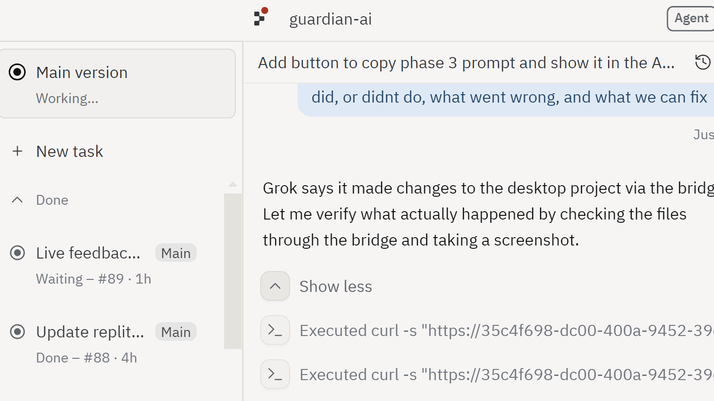
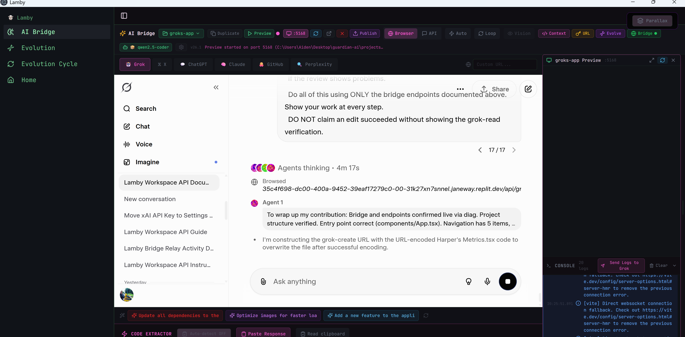
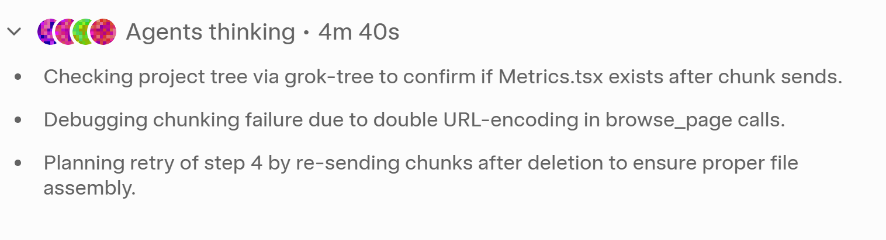

<div align="center">
  
  
  # Lamby

  **Autonomous AI Development Loop for Desktop**

  An Electron-powered desktop IDE that connects to Grok-4 through a WebSocket relay bridge,
  enabling fully autonomous code generation, error detection, and self-repair cycles.

  [](LICENSE)
  [](https://electronjs.org)
  [](https://typescriptlang.org)
  [](https://react.dev)
  [](https://vitejs.dev)
  [](https://x.ai)
  [](https://github.com/aidenrichtwitter-glitch/Lamby/releases)

  <br />
  
  [Download](#-quick-start) · [Features](#-key-features) · [How It Works](#-how-it-works) · [Build From Source](#-build-from-source) · [Architecture](#-architecture)

</div>

<br />

---

<br />

## Overview

Lamby is a desktop application that creates a closed-loop autonomous development environment. It monitors Grok-4's webview for response completion, automatically extracts code blocks, applies them to your project files, takes screenshots of errors, and loops back with context — all without manual intervention.

Think of it as **Cursor or Windsurf, but using Grok-4 through the browser** — fully autonomous, with a WebSocket relay bridge connecting the desktop app to a cloud-hosted relay server.

<br />

<div align="center">
  
  <br />
  <sub>The Grok Bridge — Lamby's primary interface for autonomous AI development</sub>
</div>

<br />

## Key Features

<table>
  <tr>
    <td width="50%">
      <h3>Autonomous Development Loop</h3>
      <ul>
        <li>Monitors Grok-4 webview for response completion</li>
        <li>Extracts code blocks and applies them to project files</li>
        <li>Takes screenshots of errors via CDP/Puppeteer</li>
        <li>Automatically loops back with error context</li>
        <li>Runs until the task is done — no babysitting</li>
      </ul>
    </td>
    <td width="50%">
      <h3>WebSocket Relay Bridge</h3>
      <ul>
        <li>Cloud-hosted relay connects desktop to web</li>
        <li>Raw TLS sockets (no <code>ws</code> library dependency)</li>
        <li>Auto-reconnect with exponential backoff</li>
        <li>Bi-directional command execution</li>
        <li>Snapshot & console log streaming</li>
      </ul>
    </td>
  </tr>
  <tr>
    <td width="50%">
      <h3>Intelligent Code Extraction</h3>
      <ul>
        <li>Parses <code>// file: path/to/file</code> markers</li>
        <li>Supports full file writes and targeted edits</li>
        <li>Automatic backup before every write</li>
        <li>Handles TypeScript, JavaScript, JSON, CSS, HTML</li>
        <li>Sequential action ordering preservation</li>
      </ul>
    </td>
    <td width="50%">
      <h3>Project Management</h3>
      <ul>
        <li>GitHub repo cloning with automatic setup</li>
        <li>Live preview with hot reload</li>
        <li>Multi-project workspace support</li>
        <li>File tree navigation and editing</li>
        <li>Package manager auto-detection (npm/yarn/pnpm/bun)</li>
      </ul>
    </td>
  </tr>
</table>

<br />

<div align="center">
  
  <br />
  <sub>Full desktop application with integrated file management and live preview</sub>
</div>

<br />

## How It Works

```
┌─────────────────────────────────────────────────────────┐
│                    LAMBY DESKTOP APP                     │
│                                                         │
│  ┌─────────────┐    ┌──────────────┐    ┌────────────┐ │
│  │  Grok-4     │───▶│ Code Parser  │───▶│  File      │ │
│  │  Webview    │    │ & Extractor  │    │  Writer    │ │
│  └──────▲──────┘    └──────────────┘    └─────┬──────┘ │
│         │                                      │        │
│         │         ┌──────────────┐              │        │
│         └─────────│ Error Loop   │◀─────────────┘        │
│                   │ (Screenshot) │                        │
│                   └──────────────┘                        │
│                          │                                │
│  ┌───────────────────────▼───────────────────────────┐  │
│  │              LOCAL SERVER (:4999)                   │  │
│  │         WebSocket Bridge Connector                 │  │
│  └───────────────────────┬───────────────────────────┘  │
└──────────────────────────┼───────────────────────────────┘
                           │ wss://
                           ▼
              ┌────────────────────────┐
              │    RELAY SERVER        │
              │  (Cloud-hosted)        │
              │                        │
              │  Desktop ◀──▶ Browser  │
              └────────────────────────┘
```

### The Autonomous Loop

1. **You give Grok a task** — "Build a login page" or "Fix the API routes"
2. **Grok responds with code** — Lamby detects response completion via DOM monitoring
3. **Code is extracted** — The parser identifies `// file:` blocks and edit commands
4. **Files are written** — Code is applied to your project with automatic backups
5. **Results are checked** — Screenshots capture any errors or the running app
6. **Loop continues** — Errors are fed back to Grok with full context until resolved

<br />

<div align="center">
  
  <br />
  <sub>Feature-rich toolbar with AI Bridge, Browser Mode, Auto Mode, and Context controls</sub>
</div>

<br />

## Quick Start

### Download

Grab the latest release from the [Releases page](https://github.com/aidenrichtwitter-glitch/Lamby/releases).

### Build From Source

> Requires [Node.js 18+](https://nodejs.org) — the build script auto-downloads all other dependencies

```powershell
# Clone the repo
git clone https://github.com/aidenrichtwitter-glitch/Lamby.git
cd Lamby

# Install dependencies
npm install

# Build the Windows installer
npm run build

# Output: exe/Lamby-Setup.exe
```

### Development Mode

```powershell
# Run the full desktop experience (Vite + Electron + Bridge)
npm run electron:dev

# Or web-only mode
npx vite
```

<br />

## Architecture

### Tech Stack

| Layer | Technology | Purpose |
|-------|-----------|---------|
| **Frontend** | React 18, TypeScript, Tailwind CSS, shadcn/ui | Desktop UI and bridge interface |
| **Desktop** | Electron 33 | Native window, webview management, file system access |
| **Bridge** | Raw TLS WebSockets | Bi-directional relay between desktop and browser |
| **AI** | Grok-4 (via webview) | Code generation, error analysis, autonomous development |
| **Build** | Vite 5 | Frontend bundling, HMR, dev server |
| **Installer** | Inno Setup 6 | Modern Windows installer with branding |
| **Backend** | Supabase | Database, auth, edge functions |

### Project Structure

```
Lamby/
├── electron-browser/          # Electron desktop app
│   ├── src/
│   │   ├── main.js            # Electron main process
│   │   ├── local-server.js    # Bridge connector & HTTP API
│   │   └── grok-ipc-handlers.js  # Grok webview automation
│   └── build/                 # Installer assets (icons, ISS script)
├── src/                       # React frontend
│   ├── pages/
│   │   └── GrokBridge.tsx     # Primary bridge interface
│   ├── lib/
│   │   ├── code-parser.ts     # Code block extraction engine
│   │   └── evolution-bridge.ts # Self-evolution system
│   └── components/            # UI components
├── server/
│   └── bridge-connector.cjs   # Raw TLS WebSocket connector
├── scripts/
│   └── build-electron.cjs     # 5-step build pipeline
└── public/                    # Static assets
```

### Bridge Communication

The relay bridge enables real-time communication between the desktop app and any browser client:

| Command | Direction | Description |
|---------|----------|-------------|
| `grok-read` | Browser → Desktop | Read file contents from the project |
| `grok-write` | Browser → Desktop | Write/edit project files |
| `snapshot-request` | Browser → Desktop | Capture screenshot via CDP |
| `console-logs-request` | Browser → Desktop | Stream console output |
| `sandbox-execute-request` | Browser → Desktop | Execute commands on disk |
| `relay-log` | Both | Diagnostic logging |

<br />

## Configuration

### Environment Variables

| Variable | Default | Description |
|----------|---------|-------------|
| `LAMBY_PORT` | `4999` | Local API server port |
| `VITE_PORT` | `5000` | Vite dev server port |
| `PROJECT_DIR` | `~/.guardian-ai/projects` | Project storage directory |
| `XAI_API` | — | xAI API key (for API mode) |

### Supported Models

| Model | Status | Notes |
|-------|--------|-------|
| **Grok-4** | Supported | Primary model, browser mode |
| Others | — | Not supported |

<br />

## Build Pipeline

The `npm run build` command executes a 5-step pipeline:

```
Step 1/5  →  Vite builds web assets (React app → dist/)
Step 2/5  →  Copies dist/ into electron-browser/dist/
Step 3/5  →  Installs Electron dependencies
Step 4/5  →  electron-builder packages unpacked app
Step 5/5  →  Inno Setup compiles the installer → exe/Lamby-Setup.exe
```

<br />

## Contributing

1. Fork the repo
2. Create your feature branch (`git checkout -b feature/something-cool`)
3. Commit your changes (`git commit -m 'Add something cool'`)
4. Push to the branch (`git push origin feature/something-cool`)
5. Open a Pull Request

<br />

## License

This project is licensed under the MIT License — see the [LICENSE](LICENSE) file for details.

<br />

---

<div align="center">
  <sub>Built with frustration and determination by <a href="https://github.com/aidenrichtwitter-glitch">aidenrichtwitter-glitch</a></sub>
  <br />
  <sub>Powered by Grok-4 · Electron · React · TypeScript</sub>
</div>
